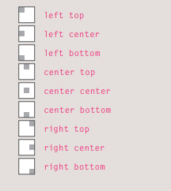

### centering images with css
   * center image : images by default are inline level elements, to center image I have to give it block level display there are 2 ways.
      1. put text-align center on parent box.
      2. give image margin auto right to left and secify width.

#### background-image
   to set background to image use `background-image` property.
    * `background-image:url('images/URL.png')`

  1. background-repeat:
     it has 4 values, repeat, repeat-x, repeat-y, no repeat.
  2. background-attachment: 
     * fixed : keep image on the same position on the page.
     * scroll : image move up and down as the user scroll
  3. background-position : 
     when image is not repeated I can use postion 
      * values : `background-position: center center`
      * values 

  4. **background** it's a shorthand for all previous values and combine them with space between each property.

  * You can specify the dimensions of images using CSS. This is very helpful when you use the same sized images on several pages of your site.
  * Images can be aligned both horizontally and vertically using CSS.
  * You can use a background image behind the box created by any element on a page.
  * Background images can appear just once or be repeated across the background of the box. 
  * You can create image rollover effects by moving the background position of an image.
  * To reduce the number of images your browser has to load, you can create image sprites.